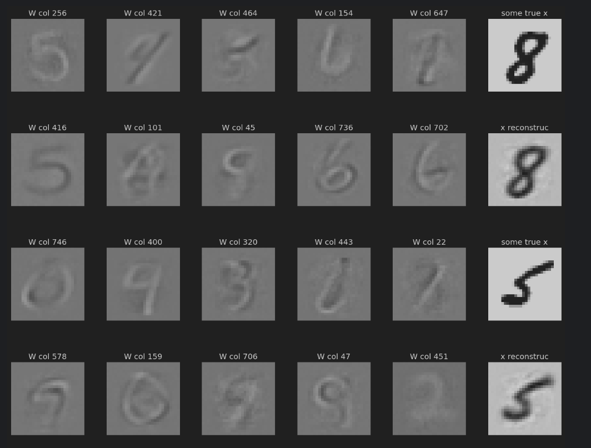
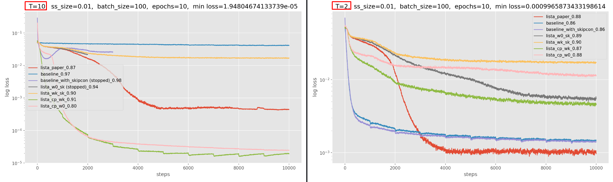
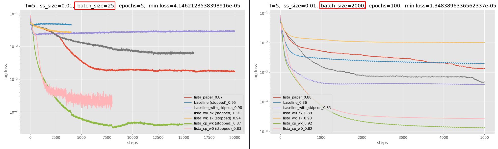
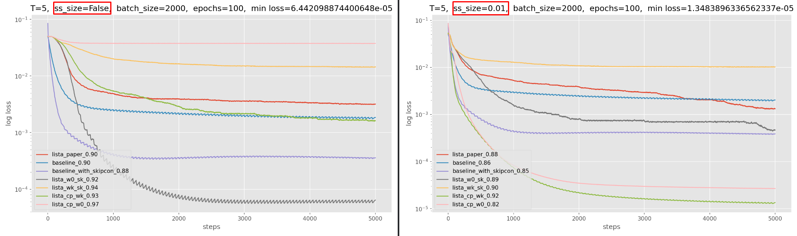
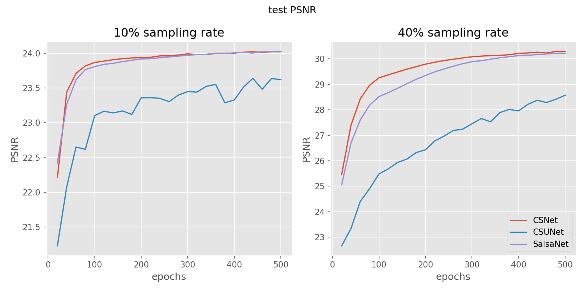
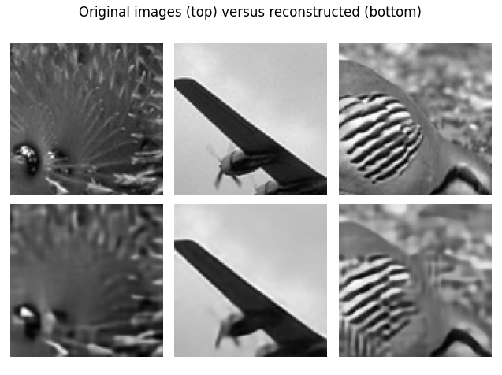

# Model based deep learning and algorithm unrolling

***********************************************************************************************************
This repo implements a variety of model based deep learning methods and is roughly split into 2 parts. All code is
written from scratch by me unless stated otherwise. 
 
The first part implements traditional sparsity aware learning algorithms ISTA, FISTA and CoD (Coordinate descent) 
as well as online dictionary learning. Lista and subsequent lista variants.
  
The second part focuses on solving image compressed sensing problems using model/algorithm inspired compressed sensing 
deep neural networks.

***********************************************************************************************************
## Part 1: Online dictionary learning and Lista variants 
All file of interest are in Lista nets folder
### ista_fista_cod.py
Implements those 3 algorithms and tests them on a simple problem to display their correctness and more importantly
their differences in speed. On said simple problem CoD is much faster than its counterparts. The test problem itself 
is not written by me but merely adapted from the exercise material of "02459 Machine Learning for Signal Processing".
CoD i.e. coordinate descent is implemented according to the paper: 
[Coordinate descent optimization for l1 minimization with application to compressed sensing; a greedy algorithm](https://www.aimsciences.org/article/doi/10.3934/ipi.2009.3.487).

### online_dict_learning_cifar10.ipynb
It was by no means the plan to implement online dictionary learning as it does not really have much to do with
model based deep learning or algorithm unrolling. However the data used for training the original lista in 
the original lista paper was generated using online dictionary learning, thus I thought I gad to generate data in
a similar manner untill I later realized I could just generate it synthetically.
  
Online dictionary learning is implemented according to [Online dictionary learning for sparse coding](https://dl.acm.org/doi/abs/10.1145/1553374.1553463?casa_token=4Xtwg11aTCMAAAAA:8jhXBQ8ufQw3ZBxK74keAm_xhnaAOottnF8UzKqOllRoCUNcAQoPplULUWeoeKD248P7ZmpFm6ef)
and is essentially an EM algorithm which starts with some initial random W which could be a DCT basis. Using that W ista, lista or
CoD is used to generated the sparse code of a batch of cifar10 data. Using the just generated sparse code, W is updated using
blockcoordinate descent with warm restarts. However my implementation extends
the dictionary learning to also be able to update W using normal gradient descent. Gradient descent takes longer
to converge but manages a smaller loss. For optimal speed and efficiency one should run blockcoordinate descent untill
convergence and then switch to gradient descent.
  
As the name implies the notebook optimizes a W corresponding to the cifar10 dataset. Lastly using the optimized W
training data is generated which can then in turn be used to train a Lista model. Training a model using the 
generated data is done in "Lista_training_cifar10.py". 
  
"online_dict_learning_mnist.ipynb" is slightly outdated but 
does the exact same as "online_dict_learning_cifar10.ipynb" but using mnist dataset.
  
It takes quite some time to optimize W using online dictionary learning. The files "W_learned_cifar10.pt" and
"W_learned_mnist.pt" are 2 such files. The columns (when reshaped) of "W_learned_mnist.pt" for instance looks as follows:

### synthetic.py
After having spend way too much time implementing online dictionary I realized I could just generate synthetic data. 
Besides being able to generate the data almost instantaneously and in arbitrarily large amounts there is another
very important aspect. The training data is exact rather than some close approximation. The lista networks easily becomes limited
by the inexactness of the data generating process when using a learned/optimzied W from online dictionary learning. 
This is the primary reason the final experiments only uses synthetic data.

### All_lista_models.py
First and foremost this script implements the original lista neural network according to 
[Learning fast approximations of sparse coding](https://dl.acm.org/doi/abs/10.5555/3104322.3104374) which is done in the 
class called "lista_paper". Additionally this scipts implements 2 naive baselines that are just fully connected 
layers with soft thresholding inbetween which does not respect the algorithmic structure of ISTA. These are called
"baseline" and "baseline_with_skipcon" respectively. Furthermore the script implements some
interpretations/extrapolations of lista "lista_w0_sk", "lista_wk_s0", "lista_wk_sk", where "w0" indicates that
the w matrix is shared between layers where as "wk" indicates that each of the k layers have their own weight matrix w.
The explanation for "s0" versus "sk" being the same. "Lista_paper" corrosponds to "lista_w0_s0".
  
Lastly the script implements an extension of lista called weight decoupling in accordance with:
[Theoretical Linear Convergence of Unfolded ISTA and its Practical Weights and Thresholds](https://arxiv.org/abs/1808.10038) 
This improves performance by incorporating the dictionary matrix into the forward pass of the network. 
There are 2 variant "lista_cp_w0" and "lista_cp_wk", where "w0" uses shared weights and "wk" uses individual
weights for each layer.
  
Last [Theoretical Linear Convergence of Unfolded ISTA and its Practical Weights and Thresholds](https://arxiv.org/abs/1808.10038) 
Also introduces the concept of support selection which is a mechanism that lets the top x percent largets elements 
of the latent code pass through the soft thresholding layer without being reduced by alpha. This mechanism is implemented for
all lista networks and is enabled using the flag "ss_size=0.01" i.e. the largest (using absolute value) 1% of the latent code will pass with
out being reduced. In general this improves performance for all lista models but greatly impacts the speed of the models.

### synth_results_all_models.py
This script trains all the models on the synthetic dataset and plots their learning curve. The models behave quite 
differently under different conditions, such conditions being batch size, model_depth (T is model depth), support selection etc.
The decimal number in the legend of the plot indicates the average sparsity of the network, i.e. 0.9 meaning 90% of the 
elements in the found latent code is 0. 
  
Sometimes the learning process of the network would become unstable and the loss would become unreasonable large 
out of nowhere. If this happened I would simply termine the training, which is the reason some of the models did not train 
The full amount of epochs. These incidents seemed rather random and I did not manage to find the course of the problem.
It does however seem to be more likely to happen for small batch sizes and deep networks (large T).

#### Performance when changing the depth/number of layers of the networks

#### Changing batch size

#### With and without support selection 

## Part 2: Compressed sensing neural networks

All files of interests are found in the "Compressed sensing nets" folder.
### CSnet.py 
Implements the nn from [Image Compressed Sensing Using Convolutional Neural Network](https://ieeexplore.ieee.org/abstract/document/8765626)

### SalsaNet.py 
Implements the nn from [SALSA-Net: Explainable Deep Unrolling Networks for
Compressed Sensing](https://www.mdpi.com/1424-8220/23/11/5142) with a few reservations: The 
"gradient update module" of the network has been omitted due to poor/insufficient descriptions in
The paper, and no provided code to draw inspiration from. In general the paper contains numerous
errors in figures and equations and the quality and credibility of the paper is questionable. Since
the "gradient update module" is omitted so is the "auxiliary update module" as it 
requires the aforementioned module. In this sense the nn implementation in this repo of salsanet is a simplified
or degenerate version of what is described in the original paper.
### CSUnet.py 
Uses the same sampling and initial reconstruction as SalsaNet.py but employs a simple
Unet as the backbone for the deep reconstruction. I thought it would be interesting to compare
the 2 model based approaches to a generic Unet inorder to see if the domain/model knowledge
incorporated in the methods actually improved performance. 

### Training.py 
Trains one of the above 3 models and tracks and saves their performance in the "results" folder.
The training and testing data is [BSDS500](https://www2.eecs.berkeley.edu/Research/Projects/CS/vision/bsds/), which
is the same as used in the [Image Compressed Sensing Using Convolutional Neural Network](https://ieeexplore.ieee.org/abstract/document/8765626).
To run the training script download and place the data in "images/test" and "images/train". As of now
each of those folders only contain 3 of the 200 images, to serve as placeholders and to demonstrate that the
Code can run.
### plotFinalResults.py 
Plots the test performance throughout a training of one of the models. It does so using
data created and cashed during training. Said cached data can be found in "results" folder.

### Results 
Already contains cashed data from running each of the 3 models using either 10% sampling rate or 40% 
sampling rate for 500 epochs. The models were matched/configured in size according to the throughput and
not the amount of learnable parameters. For instance the unet has almost 30x the amount of learn able parameters
but still has the same throughput. Plotting the cached results yields the following plot
(I am aware the models do not seem to have 
converged especially when using a sampling rate of 40%, however they do take quite long to run for this many epochs as is):

### CSnet Reconstruction on test images using a sampling rate of 10%

